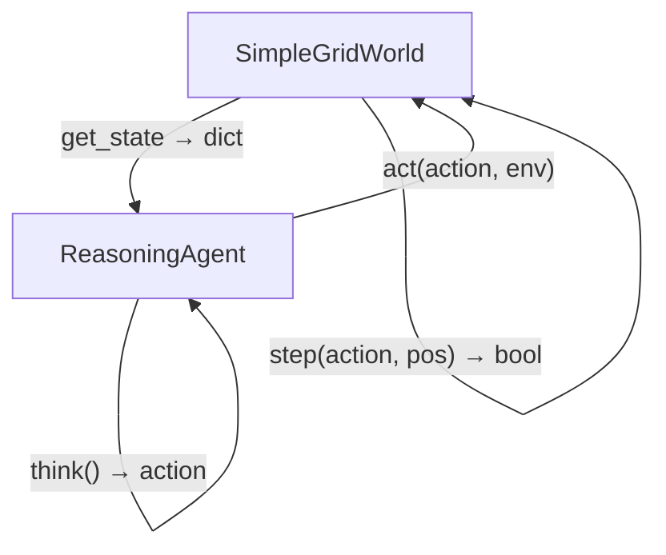

<p align="center">
  
</p>

<h1 align="center">AgentForge</h1>

<p align="center">
  <strong>Build minimal, ground-up intelligent agent reasoning loops in Python.</strong>
</p>

<p align="center">
  <a href="https://github.com/Lumi-node/agent-forge"></a>
  <a href="https://img.shields.io/badge/Python-3.10%2B-blue.svg" alt="Python Version"></a>
  <a href="https://github.com/Lumi-node/agent-forge"></a>
</p>

---

AgentForge provides a minimal, pedagogical framework for constructing intelligent agents from first principles in Python. It is designed specifically to teach the core architectural components of agent-environment interaction, such as perception, decision-making, and action execution.

This project serves as an excellent educational artifact for researchers and students looking to understand the fundamental loop of reinforcement learning and autonomous systems without the overhead of large, complex libraries.

---

## Quick Start

Requires Python 3.10+. No external dependencies.

```bash
git clone https://github.com/Lumi-node/agent-forge.git
cd agent-forge
python main.py
```

```python
from agent import ReasoningAgent
from environment import SimpleGridWorld

# Initialize environment: 5x5 grid with 5 collectible items
env = SimpleGridWorld(agent_pos=(2, 2), num_items=5)

# Initialize the agent at center of grid
agent = ReasoningAgent(start_position=(2, 2))

# Run the think-act-observe loop
for step in range(10):
    state = env.get_state()       # Get grid state dict
    agent.observe(state)          # Feed state to agent
    action = agent.think()        # Agent decides next action
    agent.act(action, env)        # Execute action in environment

print(f"Items remaining: {env.get_state()['items_remaining']}")
print(f"Actions taken: {agent.action_history}")
```

## What Can You Do?

### Think-Act-Observe Loop
Implement the core cycle of an intelligent agent: observe the environment state, reason about the next action, and execute it.

```python
state = env.get_state()   # {"grid": [[...]], "items_remaining": 5, ...}
agent.observe(state)      # Store observation in agent
action = agent.think()    # Returns: "up", "down", "left", "right", "collect", or "wait"
agent.act(action, env)    # Execute; position updates on valid moves
```

### Simple Grid World Simulation
The `SimpleGridWorld` provides a 5x5 discrete grid where the agent navigates to collect items placed at fixed positions.

```python
env = SimpleGridWorld(agent_pos=(2, 2), num_items=3)
state = env.get_state()
# state["grid"]            -> 5x5 list (1 = item, 0 = empty)
# state["items_remaining"] -> number of uncollected items
# state["step_count"]      -> total steps taken
```

## Architecture

AgentForge follows a classic Agent-Environment paradigm. The `ReasoningAgent` (in `agent.py`) is the decision-maker, responsible for processing observations and outputting actions. The `SimpleGridWorld` (in `environment.py`) acts as the world, maintaining the state, processing actions, and generating observations.

The flow is strictly sequential: **Environment $\rightarrow$ Observe $\rightarrow$ Agent $\rightarrow$ Think $\rightarrow$ Action $\rightarrow$ Environment $\rightarrow$ Update State.**



## API Reference

### `ReasoningAgent` (`agent.py`)
The core agent class responsible for decision-making.

- `__init__(start_position=(2, 2))`: Initialize agent at given `(row, col)` grid position.
- `observe(observation_dict: dict)`: Store an observation dict (from `env.get_state()`) in `self.observations`.
- `think() -> str`: Decide next action based on stored observations. Returns one of `"up"`, `"down"`, `"left"`, `"right"`, `"collect"`, or `"wait"`. Deterministic: same observations always produce the same action.
- `act(action: str, environment: SimpleGridWorld)`: Execute action in the environment. Updates `self.position` on successful directional moves. Raises `ValueError` for invalid actions. Appends every action to `self.action_history`.

### `SimpleGridWorld` (`environment.py`)
The environment class representing a 5x5 grid with collectible items.

- `__init__(agent_pos: tuple[int, int] = (2, 2), num_items: int = 5)`: Initialize grid with items at fixed positions `(0,0), (0,4), (2,0), (4,0), (4,4)`.
- `step(action: str, agent_pos: tuple[int, int]) -> bool`: Execute action at given position. Returns `True` on success, `False` on failure (out of bounds, no item to collect).
- `get_state() -> dict`: Return `{"agent_position", "grid", "items_remaining", "step_count"}`.
- `is_valid_position(pos: tuple[int, int]) -> bool`: Check if position is within 5x5 bounds.

## Research Background

This framework is inspired by foundational concepts in Artificial Intelligence, particularly the Agent-Environment interaction model popularized in classical AI texts and modern Reinforcement Learning literature (e.g., Sutton & Barto). It aims to provide a minimal, runnable implementation of this loop for educational purposes.

## Testing

Tests are available in the project directory and cover basic state transitions and observation retrieval within the `SimpleGridWorld`.

## Contributing

We welcome contributions! Please feel free to fork the repository, create a new branch, and submit a Pull Request. See the `CONTRIBUTING.md` for guidelines on coding standards and testing.

## Citation

This project is an educational implementation and does not directly cite specific external research papers, but it builds upon the foundational principles of AI Agents.

## License
MIT