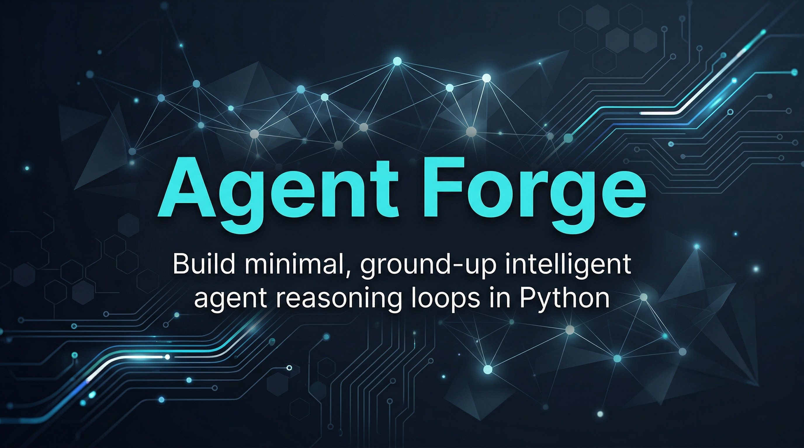
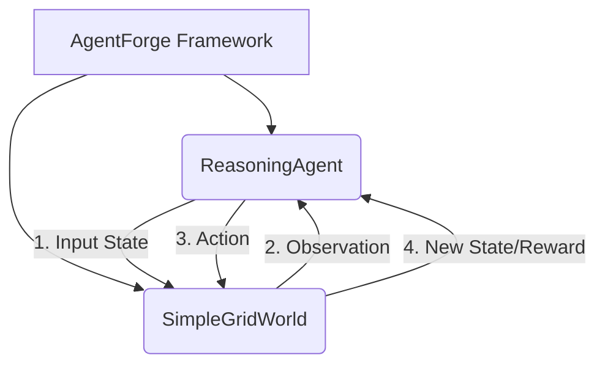

<p align="center">
  
</p>

<h1 align="center">AgentForge</h1>

<p align="center">
  <strong>Build minimal, ground-up intelligent agent reasoning loops in Python.</strong>
</p>

<p align="center">
  <a href="https://github.com/Lumi-node/agent-forge"></a>
  <a href="https://img.shields.io/badge/Python-3.10%2B-blue.svg" alt="Python Version"></a>
  <a href="https://github.com/Lumi-node/agent-forge"></a>
</p>

---

AgentForge provides a minimal, pedagogical framework for constructing intelligent agents from first principles in Python. It is designed specifically to teach the core architectural components of agent-environment interaction, such as perception, decision-making, and action execution.

This project serves as an excellent educational artifact for researchers and students looking to understand the fundamental loop of reinforcement learning and autonomous systems without the overhead of large, complex libraries.

---

## Quick Start

First, ensure you have Python 3.10 or newer installed.

```bash
pip install agent_forge
```

```python
from agent_forge.agent import ReasoningAgent
from agent_forge.environment import SimpleGridWorld

# Initialize the environment
env = SimpleGridWorld(size=5)

# Initialize the agent
agent = ReasoningAgent()

# Run a single step of the loop
observation = env.observe()
action = agent.think(observation)
new_state, reward, done = env.act(action)

print(f"Agent took action: {action}")
```

## What Can You Do?

### Agent Reasoning Loop
Implement the core cycle of an intelligent agent: perceive the state, decide on an action, and execute that action within a defined environment.

```python
# Example of the core loop structure
while not done:
    observation = env.observe()
    action = agent.think(observation)
    new_state, reward, done = env.act(action)
    # Update agent state based on feedback
```

### Simple Grid World Simulation
Utilize the `SimpleGridWorld` to simulate a basic, discrete environment where the agent navigates, collects items, and receives feedback.

```python
# Setting up the environment
grid = SimpleGridWorld(size=5)
# Agent starts at (0, 0)
```

## Architecture

AgentForge follows a classic Agent-Environment paradigm. The `ReasoningAgent` (in `agent.py`) is the decision-maker, responsible for processing observations and outputting actions. The `SimpleGridWorld` (in `environment.py`) acts as the world, maintaining the state, processing actions, and generating observations.

The flow is strictly sequential: **Environment $\rightarrow$ Observe $\rightarrow$ Agent $\rightarrow$ Think $\rightarrow$ Action $\rightarrow$ Environment $\rightarrow$ Update State.**



## API Reference

### `agent_forge.agent.ReasoningAgent`
The core agent class responsible for decision-making.

- `think(observation: dict) -> str`: Processes the current observation and returns the next action string (e.g., "UP", "DOWN").
- `act(action: str) -> tuple`: Executes the action in the environment (Note: This method is often called by the environment wrapper in a full loop).
- `observe() -> dict`: Retrieves the current internal state snapshot from the environment.

### `agent_forge.environment.SimpleGridWorld`
The environment class representing the simulation space.

- `__init__(size: int)`: Initializes the grid world.
- `observe() -> dict`: Returns a dictionary containing the agent's position and item locations.
- `act(action: str) -> tuple`: Executes the action, returning `(new_state, reward, done)`.

## Research Background

This framework is inspired by foundational concepts in Artificial Intelligence, particularly the Agent-Environment interaction model popularized in classical AI texts and modern Reinforcement Learning literature (e.g., Sutton & Barto). It aims to provide a minimal, runnable implementation of this loop for educational purposes.

## Testing

Tests are available in the project directory and cover basic state transitions and observation retrieval within the `SimpleGridWorld`.

## Contributing

We welcome contributions! Please feel free to fork the repository, create a new branch, and submit a Pull Request. See the `CONTRIBUTING.md` for guidelines on coding standards and testing.

## Citation

This project is an educational implementation and does not directly cite specific external research papers, but it builds upon the foundational principles of AI Agents.

## License
MIT