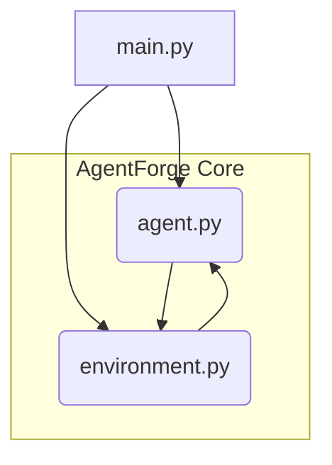

# AgentForge Architecture

AgentForge is designed as a minimal, modular framework to implement and test basic agent reasoning loops. Its core purpose is to decouple the decision-making logic (the Agent) from the simulation context (the Environment), allowing for easy swapping of complex reasoning algorithms or different world models without altering the fundamental interaction pattern.

## System Overview

The architecture follows a classic Sense-Think-Act loop paradigm. The `ReasoningAgent` is responsible for interpreting the current state provided by the `Environment`, generating a strategic action, and then executing that action. The `SimpleGridWorld` acts as the simulation engine, managing the state transitions based on the agent's commands and providing sensory feedback (observations) back to the agent. This separation ensures that the agent's intelligence remains independent of the simulation's mechanics.

## Module Relationships

The following diagram illustrates how the primary components interact within the AgentForge framework.

## Module Descriptions

### `agent.py` (The Brain)

This module contains the `ReasoningAgent` class. It encapsulates the agent's intelligence and decision-making process.

*   **`think(state)`**: This method takes the current state representation from the environment and applies the agent's reasoning logic (e.g., a simple heuristic, a learned policy) to determine the optimal next action.
*   **`act(action)`**: This method is a placeholder or wrapper that interfaces with the environment to execute the chosen action. In this minimal setup, it delegates the execution to the environment.
*   **`observe(observation)`**: This method updates the agent's internal belief state based on the feedback received from the environment after an action has been taken.

### `environment.py` (The World)

This module defines the simulation space using the `SimpleGridWorld` class. It manages the state of the world and dictates the consequences of the agent's actions.

*   **State Management**: Maintains the grid layout, agent position, and the location of collectible items.
*   **Action Execution**: Processes actions (e.g., 'UP', 'DOWN') received from the agent, calculates the resulting new state (handling boundary checks), and determines any rewards or state changes (like collecting an item).
*   **Observation Generation**: Returns a structured observation to the agent detailing the new state, rewards, and any environmental changes.

### `main.py` (The Orchestrator)

This module serves as the entry point and the control loop manager. It initializes the agent and the environment and drives the interaction cycle until a termination condition is met.

*   **Initialization**: Creates instances of `ReasoningAgent` and `SimpleGridWorld`.
*   **Loop Control**: Manages the iterative execution of the Sense-Think-Act cycle:
    1.  Observe current state from Environment.
    2.  Agent `think()` generates an action.
    3.  Agent `act()` executes the action in the Environment.
    4.  Environment returns new Observation.
    5.  Agent `observe()` updates its internal state.

## Data Flow Explanation

The data flow in AgentForge is strictly cyclical, driven by `main.py`:

1.  **Sense (Environment $\rightarrow$ Agent)**: `main.py` queries the `SimpleGridWorld` for the current state. This state is passed to `agent.py`'s `think()` method.
2.  **Think (Agent $\rightarrow$ Agent)**: `agent.py` processes the state and outputs a discrete `action` (e.g., 'NORTH').
3.  **Act (Agent $\rightarrow$ Environment)**: `main.py` passes this `action` to the `SimpleGridWorld` via the agent's `act()` interface. The environment updates its internal state based on this action.
4.  **Observe (Environment $\rightarrow$ Agent)**: The `SimpleGridWorld` calculates the resulting observation (new position, reward, etc.) and returns it to `main.py`. This observation is then passed to `agent.py`'s `observe()` method, allowing the agent to update its internal model for the next cycle.

This continuous loop ($\text{State} \rightarrow \text{Action} \rightarrow \text{New State} \rightarrow \text{Observation}$) constitutes the core reasoning framework.